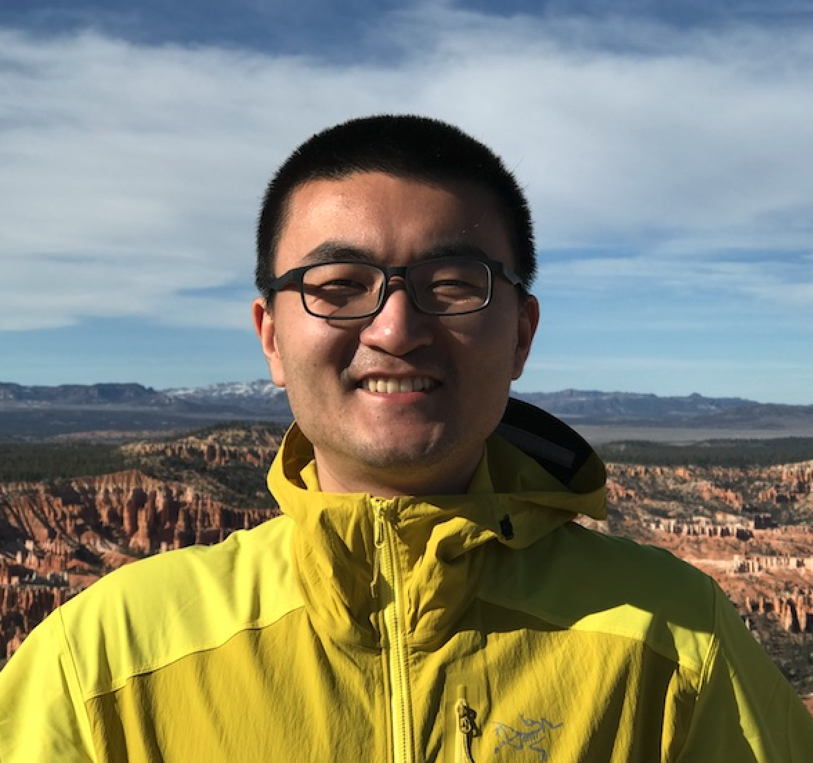

 This is the homepage of the **Privacy & Security in Machine Learning (PriSec-ML) Interest Group**. It brings together researchers and practitioners around the world broadly interested in this topic.  

### Get Involved
- Subscribe to our **[mailing list](https://www.jiscmail.ac.uk/cgi-bin/webadmin?SUBED1=PRISEC-ML&A=1)** to receive to seminar, jobs, and event announcements
- Join our **[Slack](https://join.slack.com/t/prisec-ml/shared_invite/zt-1qgwctq50-S~UfQtbldiuuwXX45D86LQ)**
- Follow us on **[Twitter](https://twitter.com/prisec_ml)**
- Subscribe to our **[YouTube channel](https://youtube.com/@prisec-ml)** where we live stream and keep recordings of the talks

### Upcoming Seminars

- 5th April 2023, 3:30pm (CET)  
**Jinyuan Jia (UIUC)**  
TBD 
 **Abstract:**    **Bio:**  

- 19th April 2023, 3:30pm (CET)  
**Jingxuan He (ETH)**  
TBD 
 **Abstract:**    **Bio:**  

- 3rd May 2023, 3:30pm (CET)  
**Christian Wressnegger (Karlsruhe Institute of Technology)**  
TBD 
 **Abstract:**    **Bio:**  

- 17th May 2023, 3:30pm (CET)  
**Sahar Abdelnabi (CISPA Helmholtz Center for Information Security)**  
TBD 
 **Abstract:**    **Bio:**  

- 14th June 2023, 4:30pm (CET)  
**Yizheng Chen (University of Maryland)**  
TBD 
 **Abstract:**    **Bio:**  

- 28th June 2023, 4:30pm (CET)  
**Xudong Pan (Fudan University)**  
TBD 
 **Abstract:**    **Bio:**  

**Google Calendar:** \[[html](https://calendar.google.com/calendar/embed?src=oormvn3d4hah013g6gd39pjpfk%40group.calendar.google.com&ctz=Europe%2FLondon)\] \[[ics](https://calendar.google.com/calendar/ical/oormvn3d4hah013g6gd39pjpfk%40group.calendar.google.com/public/basic.ics)\]

### Past Seminars

- 22nd March 2023, 3:30pm (CET)  
**Shawn Shan (University of Chicago)**  
Security beyond Defenses: Protecting DNN systems via Forensics and Recovery  
[[Recording]](https://youtu.be/20z4l824UG4)
 **Abstract:** Deep neural networks are known to be vulnerable to numerous attacks, including inference time attacks based on adversarial perturbations, as well as training time attacks such as data poisoning. The security community has done extensive work to explore both attacks and defenses, only to produce a seemingly endless cat-and-mouse game. In this talk, I will talk about some of our recent work that seeks to extend security beyond attack and defense, focusing on forensics and recovery of deployed ML systems. I start by drawing parallels with other more established security areas and argue that defenses are often only a piece of the solution. I will talk about two additional aspects of security, post-attack forensics and recovery. I will present recent results from two papers in this space (Usenix Security and CCS 2022), where we explore the role of post-attack mitigation for improving DNN robustness against both poisoning attacks and adversarial examples.   **Bio:** Shawn Shan is a PhD student at the University of Chicago. He obtained his M.S and B.S. at University of Chicago. His research focuses on the security and privacy of ML systems exploring the vunlerability of ML systems as well as protecting users from malicious uses of ML systems. His work has been covered by media outlets such as New York Times, NBC News, Die Zeit, MIT Tech Review. 

- 15th March 2023, 3:30pm (CET)  
**Wenbo Guo (UC Berkeley)**  
Strengthening and Enriching Machine Learning for Cybersecurity  
[[Recording](https://youtu.be/JMO1YSSQKfY)]
 **Abstract:** Nowadays, security researchers are increasingly using AI to automate and facilitate security analysis. Although making some meaningful progress, AI has not maximized its capability in security yet, mainly due to two challenges. First, existing ML techniques have not reached security professionals' requirements in critical properties, such as interpretability and adversary-resistancy. Second, Security data imposes many new technical challenges, and these challenges break the assumptions of existing ML models and thus jeopardize their efficacy. In this talk, I will describe my research efforts to address the above challenges, with a primary focus on strengthening the interpretability of ML-based security systems and enriching ML to handle low-quality labels in security data. I will describe our technique to robustify existing explanation methods against attacks and a novel explanation method for deep learning-based security systems. I will also demonstrate how security analysts could benefit from explanations to discover new knowledge and patch ML model vulnerabilities. Then, I will introduce a novel ML system to enable high accurate categorizations of low-quality attack data and demonstrate its utility in a real-world industrial-level application. Finally, I will conclude by highlighting my plan towards maximizing the capability of advanced ML in cybersecurity.   **Bio:** Wenbo Guo is a PostDoc. Associate at UC Berkeley working with Prof. Dawn Song. His research interests are machine learning and cybersecurity. His work includes strengthening the fundamental properties of machine learning models and designing customized machine learning models to handle security-unique challenges. He is a recipient of multiple prestigious awards, including the IBM Ph.D. Fellowship (2020-2022) and ACM CCS Outstanding Paper Award (2018). 

- 7th December 2022  
**Ahmed Salem (Microsoft Research)**  
Adversarial Exploration of Machine Learning Models' Accountability  
[[Recording](https://youtu.be/rM3mjAgv2Q8)] 
 **Abstract:**  The increasing cost of training machine learning (ML) models has led to the inclusion of new parties to the training pipeline, such as users who contribute training data. This involvement of new parties in the ML training process has introduced new training time attack surfaces for an adversary to exploit. In this talk, we will discuss a new class of training time attacks, namely the model hijacking attack, whereby the adversary aims to hijack a target model to execute a different task than its original one. Model hijacking can cause accountability risks since a hijacked model's owner can be framed for having their model offer illegal or unethical services. First,  we will introduce the hijacking attack in simple settings where the hijacking and original tasks/data are of the same modality. Next, we will discuss how the model hijacking attack can be generalized to the multimodal setting.  **Bio:** Ahmed Salem is a post-doctoral researcher in the Confidential Computing group at Microsoft Research. His research interests lie in the intersection of accountability, privacy, security, and machine learning. He obtained his Ph.D. from Saarland University (CISPA) in 2022. Homepage: https://ahmedsalem2.github.io/ 

- 9th November 2022  
**Xuechen Li (Stanford University)**  
Some Recent Developments in Differentially Private Deep Learning  
[[Recording](https://www.youtube.com/watch?v=jFWtv81F7M8)]  
 **Abstract:** Differentially private deep learning is the gold standard for privacy-preserving deep learning but has been reported to suffer from performance and efficiency issues. In this talk, I will present a series of works done with collaborators that improves the practicality and trustworthiness of methods in this space. We show that performant models can be trained with differential privacy on small datasets with publicly pretrained models and appropriate hyperparameters. We show that a form of per-layer clipping, when carefully implemented, results in private training workflows with computational efficiency approaching that of non-private training per epoch. Some of these techniques have seen initial adoption by product teams at Microsoft, e.g., for differentially private synthetic text generation. One common wisdom in private learning has been that large models tend to perform poorly when trained with differentially private stochastic gradient descent (DP-SGD). This intuition is partly based on results in private convex optimization and seemingly contradicts our empirical findings. To resolve this, we study when the problem size adversely affects the performance of private learning. Theoretically, we show that DP-SGD can result in dimension-independent bounds (even when gradients span the entire ambient space) for unconstrained problems. Empirically, we show that gradients of language models obtained during fine-tuning are mostly controlled by a few principal components—-a behavior that is similar to conditions under which we obtain dimension-independent bounds for private convex learning. Prior works have identified that privacy guarantees come at a cost of other aspects of trustworthy machine learning. We show that differentially private training consistently produces models with over-confident predictions in practice, resulting in a privacy-calibration tradeoff. We show that this tradeoff can be addressed through differentially private variants of temperature scaling and Platt scaling. In the end, time permitting, we will discuss future directions in this space and the ethics of training on sensitive data.  **Bio:** Xuechen Li is a PhD student at Stanford CS developing techniques for trustworthy machine learning. A big part of his current research is on studying memorization and privacy risks of large neural networks. He has previously worked at Google Brain and Microsoft Research.

- 26th October 2022  
**Varun Chandrasekaran (Microsoft Research)**  
Interdisciplinary Research Yields New Insights: A Case-Study in Privacy & ML  
[[Recording](https://www.youtube.com/watch?v=uMXxfA3LmiM)] 
 **Abstract:** Machine learning has enabled innovations in a variety of areas. However, “privacy in machine learning” is still not well established and is an area of active research. In this talk, I will describe how we approach this problem by drawing insight from different areas in computer science. First, I will discuss how “more utilitarian” private data can be synthesized using generative models aided by causality. Next, I will attempt to shed more light on the efficacy of privacy attacks by connecting it to label memorization. Then, I will discuss how cryptography helps enable a new swarth of private ML applications.   **Bio:** Varun Chandrasekaran is a post-doctoral researcher in the Adaptive Systems and Interaction group at Microsoft Research. He is also an adjunct assistant professor at the University of Illinois Urbana-Champaign, where he will join the ECE department full-time in 2023. 

- 5th October 2022  
**Matthew Jagielski (Google Research)**  
Some Results on Privacy and Machine Unlearning  
[[Recording](https://www.youtube.com/watch?v=Dcd_dzBWgQE)]
 **Abstract:** Machine unlearning has received significant attention recently as a result of regulations promoting the "right to be forgotten". Recent work (Chen et al. 2021) has shown that machine unlearning can lead to easier membership inference attacks on deleted points. In this talk, I will discuss a couple other interesting privacy phenomena related to machine unlearning. First, I will discuss how deleting a record may make membership inference easier on other records, in the "privacy onion effect". Next, I will discuss how training on very large datasets can lead to "forgetting", and I will discuss the relationship between forgetting and machine unlearning.   **Bio:** Matthew is a research scientist at Google on the Brain Privacy and Security team. He works at the intersection of privacy, security and machine learning. He received his PhD from Northeastern University. 

- 28th September 2022  
**Tianhao Wang (University of Virginia)**  
Continuous Release of Data Streams under Differential Privacy  
[[Recording](https://www.youtube.com/watch?v=RhSDyF953X8)]
 **Abstract:** Most differential privacy (DP) algorithms are designed to handle static data. Handling dynamic data with DP is a challenge. In this talk, I will summarize existing solusions towards dynamic data. As a special case, I will then talk into details about our recent CCS paper for publishing a stream of real-valued data satisfying DP. Here one major challenge is that the maximal possible value in the stream can be quite large, leading to enormous DP noise and bad utility. To overcome this problem, we use a commonly seen technique called truncation. Our idea is to find an optimal truncation parameter (approximately, satisfying DP) achieving a balance between bias and variance. I will present our complete solution which consists of (in addition to truncation) an online hierarchical method and a post-processing step.   **Bio:** Tianhao Wang is an assistant professor of computer science at the University of Virginia. He also hold a secondary appointment at the School of Data Science. His research interests lie in data privacy and security, and their connections to machine learning, cryptography, and human factors. He obtained his Ph.D. from Purdue University in 2021 and held a postdoc position at Carnegie Mellon University. His work about differentially private synthetic data generation won multiple awards in NIST's competition.  

- 12 July 2022  
**Soham De and Leonard Berrada (DeepMind)**  
Unlocking High-Accuracy Differentially Private Image Classification through Scale  
[[Recording](https://www.youtube.com/watch?v=0tLbQ7-9wGE)]
 **Abstract:**  Differential Privacy (DP) provides a formal privacy guarantee preventing adversaries with access to a machine learning model from extracting information about individual training points. Differentially Private Stochastic Gradient Descent (DP-SGD), the most popular DP training method, realizes this protection by injecting noise during training. However previous works have found that DP-SGD often leads to a significant degradation in performance on standard image classification benchmarks. Furthermore, some authors have postulated that DP-SGD inherently performs poorly on large models, since the norm of the noise required to preserve privacy is proportional to the model dimension. In this talk, we will describe our [recent paper](https://arxiv.org/abs/2204.13650) where we demonstrate that DP-SGD on over-parameterized models can perform significantly better than previously thought. Combining careful hyper-parameter tuning with simple techniques to ensure signal propagation and improve the convergence rate, we achieve 81.4% test accuracy on CIFAR-10 under (8, 10^(-5))-DP using a 40-layer Wide-ResNet, improving over the previous best result of 71.7%. When fine-tuning a pre-trained Normalizer-Free Network, we achieve 86.7% top-1 accuracy on ImageNet under (8, 8x10^(-7))-DP, markedly exceeding the previous best of 47.9% under a larger privacy budget of (10, 10^(-6))-DP.  **Bios:** Soham De is a Senior Research Scientist at DeepMind in London. He is interested in better understanding and improving large-scale deep learning, and currently works on optimization and initialization. Prior to joining DeepMind, he received his PhD from the Department of Computer Science at the University of Maryland, where he worked on stochastic optimization theory and game theory.  Leonard Berrada is a research scientist at DeepMind. His research interests span optimization, deep learning, verification and privacy, and lately he has been particularly interested in making differentially private training to work well with neural networks. Leonard completed his PhD in 2020 at the University of Oxford, under the supervision of M. Pawan Kumar and Andrew Zisserman. He holds an M.Eng. from University of California, Berkeley, an M.S. from Ecole Centrale-Supelec, and B.S. from University Paris-Sud and Ecole Centrale-Supelec.

- 15 June 2022  
**Ben Y. Zhao (University of Chicago)**  
Adversarial Robustness via Forensics in Deep Neural Networks   
[[Recording](https://www.youtube.com/watch?v=2NVpffuHnJI)]
 **Abstract:** Despite their tangible impact on a wide range of real world applications, deep neural networks are known to be vulnerable to numerous attacks, including inference time attacks based on adversarial perturbations, as well as training time attacks such as backdoors. The security community has done extensive work to explore both attacks and defenses, only to produce a seemingly endless cat-and-mouse game. In this talk, I will talk about some of our recent work into digital forensics for DNNs. I start by summarizing some of our recent projects at UChicago SAND Lab covering both sides of the struggle, including honeypot defenses (CCS 2020) and physical domain poison attacks (CVPR 2021). Our  experiences in these projects motivated us to seek a more realistic view towards adversarial robustness for DNNs, beyond the current static, binary views of attack and defense. We take a more pragmatic view that given sufficient incentive and resources, attackers will eventually succeed in compromising DNN systems. Just as in traditional security realms, digital forensics tools can serve dual purposes: identifying the sources of the compromise so that they can be mitigated, while also providing a strong deterrent against future attackers.  I will present results from our first paper in this space (Usenix Security 2022), specifically addressing forensics for poisoning attacks against DNNs, and show how we can trace back corrupted models to specific subsets of training data responsible for the corruption. Our approach builds up on ideas from model unlearning, and succeeds with high precision/recall for both dirty- and clean-label attacks.  **Bio:** Ben Zhao is Neubauer Professor of Computer Science at University of Chicago. Prior to joining UChicago, he held the position of Professor of Computer Science at UC Santa Barbara. He completed his Ph.D. at U.C. Berkeley (2004), and B.S. from Yale (1997). He is a Fellow of the ACM, and a recipient of the NSF CAREER award, MIT Technology Review's TR-35 Award (Young Innovators Under 35), ComputerWorld Magazine's Top 40 Technology Innovators award, IEEE ITC Early Career Award, and Google Faculty awards. His work has been covered by media outlets such as New York Times, Boston Globe, LA Times, MIT Tech Review, Wall Street Journal, Forbes, Fortune, CNBC, MSNBC, New Scientist, and Slashdot.  He has published extensively in areas of security and privacy, machine learning, networking, and HCI. He served as TPC (co)chair for the World Wide Web conference (WWW 2016) and ACM Internet Measurement Conference (IMC 2018). He also serves on the steering committee for HotNets, and was general co-chair for HotNets 2020. Homepage: [https://cs.uchicago.edu/people/ben-y-zhao/](https://cs.uchicago.edu/people/ben-y-zhao/) 

- 1 June 2022  
**Shruti Tople (Microsoft Research)**  
Causal vs Associational Machine Learning: A Privacy Perspective  
[[Recording](https://youtu.be/L9-PEkfNC1k)]
 **Abstract:** In this talk, we will analyze two different learning paradigms from a privacy perspective: associational and causal machine learning. Associational models such as DNNs have been shown to rely on spurious features for prediction tasks and often fail to generalize when there is a slight change in the distribution of the spurious features. Moreover, their inability to generalize has been identified as a key reason for leaking sensitive information such as membership of training data points. In contrast, causal models have been shown to learn invariant features from the training dataset and have better generalization properties. The first part of the talk establishes a theoretical link between causality and privacy: compared to associational models, causal models provide stronger differential privacy guarantees and are more robust to membership inference attacks. The second part focuses on empirically validating the theoretical claims under different settings in practice: results demonstrate that causal learning can be a promising direction to balance the privacy-utility tradeoff in machine learning models.  **Bio:** Shruti is a senior researcher in the Confidential Computing group at Microsoft Research Cambridge, UK. Her research broadly includes security and privacy in cloud computing, machine learning algorithms, and trusted hardware techniques. Her current research focuses on both theoretical and empirical understanding of threat to private data used in machine learning by designing new attacks and defenses. Her work has been published papers in top tier security/privacy and ML conferences such as CCS, NDSS, Usenix Security, PETS and ICML. She has also been on the program committee of CCS, Usenix Security, PETS, ICML, AISTATS, and NeurIPS. Prior to joining Microsoft Research, she pursued her Ph.D. from the School of Computing at National University of Singapore where she received the Dean's Graduate Research Excellence award for her thesis work. Homepage: [https://www.microsoft.com/en-us/research/people/shtople/](https://www.microsoft.com/en-us/research/people/shtople/) 

- 18 May 2022  
**Neil Zhenqiang Gong (Duke University)**  
Secure Self-supervised Learning  
[[Recording](https://www.youtube.com/watch?v=PdMUuRG-cmA)]
 **Abstract:** Self-supervised learning has made revolutionary progress in the past several years and is commonly believed to be a promising approach for general-purpose AI. In particular, self-supervised learning aims to pre-train an encoder (also known as foundation model) using a large amount of unlabeled data. The pre-trained encoder is like an "operating system" of the AI ecosystem. Specifically, the encoder can be used as a general-purpose feature extractor for many downstream tasks with little or even no labeled training data. In this talk, we will discuss the security of pre-trained encoders. Studying the security of pre-trained encoders is like studying the operating-system-level security of AI. In the first part of this talk, we will show that an attacker can embed a backdoor into a pre-trained encoder, such that multiple downstream classifiers built based on the backdoored encoder inherit the backdoor behavior simultaneously. AI companies often use our public data on the Internet to pre-train encoders even if we didn't authorize them to do so. Therefore, in the second part of this talk, we will discuss a method to audit unauthorized data use in pre-training encoders.  **Bio:** Neil Gong is an Assistant Professor in the Department of Electrical and Computer Engineering and Department of Computer Science (secondary appointment) at Duke University. He is interested in cybersecurity and data privacy with a recent focus on the intersections between security, privacy, and machine learning. He received an NSF CAREER Award, ARO Young Investigator Program (YIP) Award, Rising Star Award from the Association of Chinese Scholars in Computing, IBM Faculty Award, Facebook Research Award, and multiple best paper or best paper honorable mention awards. He received a B.E. from the University of Science and Technology of China in 2010 (with the highest honor) and a Ph.D. in Computer Science from the University of California, Berkeley in 2015. Homepage: [https://people.duke.edu/~zg70/](https://people.duke.edu/~zg70/) 

- 4 May 2022, 14:30  
**Suman Jana (Columbia University)**  
Scalable, Accurate, Robust Binary Analysis with Transfer Learning  
[[Recording](https://youtu.be/j9ol3b3azD0)]
 **Abstract:** Binary program analysis is a fundamental building block for a broad spectrum of security tasks. Essentially, binary analysis encapsulates a diverse set of tasks that aim to understand and analyze behaviors/semantics of binary programs. Existing approaches often tackle each analysis task independently and heavily employ ad-hoc task-specific brittle heuristics. While recent ML-based approaches have shown some early promise, they too tend to learn spurious features and overfit to specific tasks without understanding the underlying program semantics. In this talk, I will describe some of our recent projects that use transfer learning on both binary code and execution traces to learn binary program semantics and transfer the learned knowledge for different binary analysis tasks. Our key observation is that by designing pretraining tasks that can learn binary code semantics, we can drastically boost the performance of binary analysis tasks. Our pretraining tasks are fully self-supervised &ndash; they do not need expensive labeling effort and therefore can easily generalize across different architectures, operating systems, compilers, optimizations, and obfuscations. Extensive experiments show that our approach drastically improves the performance of popular tasks like binary disassembly, matching semantically similar binary functions, and recovering types from binary.  **Bio:** Suman Jana is an associate professor in the department of computer science and the data science institute at Columbia University.  His primary research interest is at the intersections of computer security and machine learning. His research has received six best paper awards, a CACM research highlight, a Google faculty fellowship, a JPMorgan Chase Faculty Research Award, an NSF CAREER award, and an ARO young investigator award. Homepage: [https://www.cs.columbia.edu/~suman/](https://www.cs.columbia.edu/~suman/) 

- 20 April 2022  
**Florian Tramèr (Google Brain & ETH)**  
From average-case to worst-case privacy leakage in neural networks  
[[Recording](https://www.youtube.com/watch?v=44kTB1EJPmE)]
 **Abstract:** Deep neural networks' ability to memorize parts of their training data is a privacy concern for models trained on user data. Yet, this privacy risk is not uniform across data points.
I'll first show how an adversary can identify a small fraction of "worst-case" training samples with very high precision (>10x higher than in prior work), by combining a number of ideas from the literature. Then, I'll introduce a new privacy-poisoning attack on machine learning models, that succeeds in re-identifying *any* training sample with high precision. Our new attack shows that against a determined adversary, the privacy risk of the average data point is similar to the risk of the worst-case data point.
I'll conclude by discussing how attacks can be used to audit the correctness of differential privacy defenses.  **Bio:** Florian Tramèr is a visiting researcher at Google Brain and an assistant professor of computer science at ETH Zurich. His research interests lie in Computer Security, Cryptography and Machine Learning security. In his current work, he studies the worst-case behavior of Deep Learning systems from an adversarial perspective, to understand and mitigate long-term threats to the safety and privacy of users. Homepage: [https://floriantramer.com](https://floriantramer.com) 

- 23 March 2022  
**Heng Yin (UC Riverside)**  
Learning Binary Code Representations for Security Applications  
[[Recording](https://youtu.be/4MtUbyN-vGo)]
 **Abstract:** Learning a numeric representation (also known as an embedded vector, or simply embedding) for a piece of binary code (an instruction, a basic block, a function, or even an entire program) has many important security applications, ranging from vulnerability search, plagiarism detection, to malware classification.  By reducing a binary code with complex control-flow and data-flow dependencies into a numeric vector using deep learning techniques, we convert complex binary code detection and search problems into the search of embeddings, which can be done in O(1) time and often can achieve even higher accuracy than traditional methods. In this talk, I am going to show how we can revolutionize several security applications using this approach, including vulnerability search, malware variant detection, and binary diffing.  **Bio:** Dr. Heng Yin is a Professor in the Department of Computer Science and Engineering at University of California, Riverside. He is the director of CRESP (Center for Research and Education in Cyber Security and Privacy) at UCR. He obtained his PhD degree from the College of William and Mary in 2009. His research interests lie in computer security, with emphasis on binary code analysis. His publications appear in top-notch technical conferences and journals, such as ACM CCS, USENIX Security, NDSS, TSE, TDSC, etc. His research is sponsored by National Science Foundation (NSF), Defense Advanced Research Projects Agency (DARPA), Air Force Office of Scientific Research (AFOSR), and Office of Navy Research (ONR). In 2011, he received the prestigious NSF Career award. He was a member of CodeJitsu, one of the seven finalists in DARPA Cyber Grand Challenge. He received Google Security and Privacy Research Award and ACSAC best paper award. Home: [https://www.cs.ucr.edu/~heng/](https://www.cs.ucr.edu/~heng/) 

- 23 February 2022,  
**Giulia Fanti (Carnegie Mellon University)**  
Tackling Data Silos with Synthetic Data  
[[Recording](https://youtu.be/dnFa92daKxA)]
 **Abstract:** Organizations are often unable to share data due to regulatory, business, and privacy concerns. The resulting data silos seriously inhibit the development, tuning, testing, and auditing of data science pipelines. In this talk, I will discuss the promise and challenges of using synthetic data from deep generative models to share data across institutional boundaries, thereby mitigating data silos. I will focus on a case study from the networking and security domain, in which we produce synthetic network traces using generative adversarial networks (GANs). We study key challenges related to the fidelity, privacy, and interpretability of the synthetic data. Doing so involves both system design and addressing fundamental learning challenges for GANs. Ultimately, we demonstrate NetShare, a synthetic data generator for network packet header traces; NetShare matches microbenchmark distributions in real data 40% better than baselines, while also enabling synthetic data users to train models for downstream tasks. At the same time, we show that popular approaches for training privacy-preserving models (e.g., differentially-private optimization, pre-training on public data) are ill-suited to our application domain, and highlight the need for new privacy tools.  **Bio:** Giulia Fanti is an Assistant Professor of Electrical and Computer Engineering at Carnegie Mellon University. Her research interests span the security, privacy, and efficiency of distributed systems. She is a two-time fellow of the World Economic Forum’s Global Future Council on Cybersecurity and a member of NIST's Information Security and Privacy Advisory Board. Her work has been recognized with best paper awards (Sigmetrics and MobiHoc) and faculty research awards from the Sloan Foundation, Intel, the U.S. Air Force Research Laboratory, Google, and JP Morgan Chase. She obtained her Ph.D. in EECS from U.C. Berkeley and her B.S. in ECE from Olin College of Engineering. Home: [https://www.ece.cmu.edu/directory/bios/fanti-giulia.html](https://www.ece.cmu.edu/directory/bios/fanti-giulia.html) 

- 9 March 2022  
**Gang Wang (University of Illinois at Urbana-Champaign)**  
Online Deception in the Age of Machine Learning  
[[Recording](https://youtu.be/00WeMyk24tg)]
 **Abstract:** Machine learning (ML) is in the process of reshaping the ways in which users consume content and interact with each other on the Internet. At the same time, ML’s ability to generate and manipulate media content also revolutionizes how attackers run deceptive campaigns to manipulate public options and perform social engineering attacks. In this talk, I will describe our recent efforts to understand the emerging threat vectors introduced by machine learning algorithms and study how they would affect users. First, I will talk about how machine learning can be used to subvert common tools designed for cybercrime forensics and tracing sources of misinformation, using perceptual hashing tools as an example. Second, I will share our study results to understand how users perceive (and establish trust towards) algorithm-generated online personas in the social engineering context and examine the effectiveness of potential intervention strategies. Finally, I will discuss the open questions in combating online deception and the role that machine learning can play to strengthen our defenses.  **Bio:** Gang Wang is an Assistant Professor of Computer Science at University of Illinois at Urbana-Champaign. He obtained his Ph.D. from UC Santa Barbara in 2016, and a B.E. from Tsinghua University in 2010. Before joining University of Illinois, he worked as an assistant professor at Virginia Tech from 2016 to 2019. His research interests are Security and Privacy, Data Mining, and Internet Measurements. His work primarily takes a data-driven approach to address emerging security threats in massive communication systems (e.g., online social networks, email systems), crowdsourcing systems, mobile applications, and enterprise networks. He is a recipient of the NSF CAREER Award (2018), Amazon Research Award (2021), Google Faculty Research Award (2017), and Best Paper Awards from IMWUT 2019, ACM CCS 2018, and SIGMETRICS 2013. His projects have been covered by various media outlets such as MIT Technology Review, The New York Times, Boston Globe, and ACM TechNews. Home: [https://gangw.cs.illinois.edu](https://gangw.cs.illinois.edu) 

- 9 February 2022  
**Ferdinando Fioretto (Syracuse University)**  
Privacy-preserving ML and decisions-making: uses and unintended disparate effects  
[[Recording](https://youtu.be/RRvG9As8q6s)]
 **Abstract:** Since its conception, differential privacy (DP) has become an important privacy-enhancing technology for private analysis tasks. Several private companies and federal agencies are rapidly developing their implementation of DP, including the notable adoption by the US Census Bureau for their 2020 release. Importantly, the DP data or models released do not live in a vacuum. They are often used to make important policy decisions with significant societal and economic impacts for the involved individuals. For example, US census data users rely on the decennial census data to apportion congressional seats, allocate a multi-trillion budget, and distribute critical resources to states and jurisdictions. When this data is protected using differential privacy, the resulting decisions may have significant errors with disproportionate societal and economic impacts for participating individuals. In this talk, I will focus on the challenge of releasing privacy-preserving data sets for complex data analysis or learning tasks. I will discuss the impact that differential privacy may have on the fairness of a downstream decision process, analyze the sources of this issue, examine the conditions under which decision-making is fair when using differential privacy, and propose several mitigation approaches to either alleviate or bound unfairness. Finally, I will conclude with some open questions.  
**Bio:** Ferdinando Fioretto is an Assistant Professor of Computer Science at Syracuse University. He works on optimization, differential privacy, and machine learning. Ferdinando's recent work focuses on how to make AI algorithms better aligned with societal values, especially privacy and fairness, and how to integrate machine learning with optimization to  solve complex optimization problems. He is the recipient of the 2021 Mario Gerla Young Investigator Award by ISSNAF, the 2021 Early Career Researcher Award by the Association for Constraint Programming,  a Best AI dissertation award (AI*IA 2017), and several best paper awards. Among other activities, he co-organizes the annual AAAI privacy-preserving AI (PPAI) workshop. Home Page: [https://web.ecs.syr.edu/~ffiorett/](https://web.ecs.syr.edu/~ffiorett/) 

- 26 January 2022  
**Li Xiong (Emory University)**  
Trustworthy Machine Learning with Both Differential Privacy and Certified Robustness  
[[Recording](https://youtu.be/JCPK4wh-C88)]
 **Abstract:** While deep learning models have achieved great success, they are also vulnerable to potential manipulations, ranging from model inversion attacks that attempt to infer sensitive training data from a model, to adversarial example attacks that create manipulated data instances to deceive a model.  In this talk, I will present our recent work on achieving 1) differential privacy (DP) to ensure privacy of the training data and 2) certified robustness against adversarial examples for deep learning models.  First, I will present a practical DP training framework for centralized setting with better empirical and theoretical utility (IJCAI’21).  Second, I will present a certified robustness approach via randomized smoothing for quantized neural networks (ICCV ’21). Finally, I will present a framework that kills two birds with one stone and achieves DP and certified robustness via randomized smoothing simultaneously.
  **Bio:** Li Xiong is a Professor of Computer Science and Biomedical Informatics at Emory University. She held a Winship Distinguished Research Professorship from 2015-2018. She has a Ph.D. from Georgia Institute of Technology, an MS from Johns Hopkins University, and a BS from the University of Science and Technology of China. She and her research lab, Assured Information Management and Sharing (AIMS), conduct research on the intersection of data management, machine learning, and data privacy and security. She has published over 160 papers and received six best paper (runner up) awards. She has served and serves as associate editor for IEEE TKDE, VLDBJ, IEEE TDSC, general or program co-chairs for ACM CIKM 2022, IEEE BigData 2020, and ACM SIGSPATIAL 2018, 2020. Her research has been supported by National Science Foundation (NSF), AFOSR (Air Force Office of Scientific Research), National Institute of Health (NIH), and Patient-Centered Outcomes Research Institute (PCORI). She is also a recipient of Google Research Award, IBM Smarter Healthcare Faculty Innovation Award, Cisco Research Awards, AT&T Research Gift, and Woodrow Wilson Career Enhancement Fellowship.  She is an ACM distinguished member.  More details at [http://www.cs.emory.edu/~lxiong](http://www.cs.emory.edu/~lxiong). 

- 1 December 2021  
**Eugene Bagdasaryan (Cornell Tech and Apple)**  
Blind Backdoors in Deep Learning  
[[Recording](https://youtu.be/TCBPX3CA5UQ)]
 **Abstract:** We investigate a new method for injecting backdoors into machine learning models, based on compromising the loss-value computation in the model-training code. We use it to demonstrate new classes of backdoors strictly more powerful than those in the prior literature: single-pixel and physical backdoors in ImageNet models, backdoors that switch the model to a covert, privacy-violating task, and backdoors that do not require inference-time input modifications.  
Our attack is blind: the attacker cannot modify the training data, nor observe the execution of his code, nor access the resulting model. The attack code creates poisoned training inputs "on the fly," as the model is training, and uses multi-objective optimization to achieve high accuracy on both the main and backdoor tasks. We show how a blind attack can evade any known defense and propose new ones.
  **Bio:** Eugene is a PhD Candidate at Cornell Tech advised by Vitaly Shmatikov and Deborah Estrin. He is an Apple AI/ML Scholar. He focuses on privacy and security implications of applying machine learning in the real world, specifically backdoor attacks and defenses, differential privacy, and federated learning. [https://www.cs.cornell.edu/~eugene/](https://www.cs.cornell.edu/~eugene/) 

- 17 November 2021  
**Reza Shokri (National University of Singapore)**  
Advanced Membership Inference Attacks  
[[Recording](https://youtu.be/Ud7-sSJTG2k)]
 **Abstract:** Data Protection regulations, such as GDPR, and AI governance frameworks require personal data to be protected when used in AI systems, and that the users have control over their data and awareness about how it is being used. For example, Article 35 of GDPR requires organizations to systematically analyze, identify and minimize the data protection risks of a project, especially when it involves innovative technologies such as deep learning. Thus, proper mechanisms need to be in place to quantitatively evaluate and verify the privacy of individuals in every step of the data processing pipeline in AI systems. In this talk, I will define what data privacy is in the context of machine learning, and how it can be quantified. I will also present ML Privacy Meter tool that enables quantifying the privacy risks of machine learning models. The tool produces privacy risk analysis reports, which help in identifying data records among the training data that are under high risk of being leaked through the model parameters or predictions.  
The privacy risk analysis in ML Privacy Meter is based on membership inference attacks. In this talk, I present a formal framework to reason about such attacks, and introduce new powerful attacks that outperform the existing attacks and are designed to precisely quantify the information leakage through models. This is a joint work with Jiayuan Ye, Aadyaa Maddi, and Sasi Murakonda  **Bio:** Reza Shokri is a NUS Presidential Young Professor of Computer Science. His research focuses on data privacy and trustworthy machine learning. He is a recipient of the IEEE Security and Privacy (S&P) Test-of-Time Award 2021, for his paper on quantifying location privacy. He received the Caspar Bowden Award for Outstanding Research in Privacy Enhancing Technologies in 2018, for his work on analyzing the privacy risks of machine learning models. He received the NUS Early Career Research Award 2019, VMWare Early Career Faculty Award 2021, Intel Faculty Research Award (Private AI Collaborative Research Institute) 2021-2022, and Google PDPO Faculty Award 2021. He obtained his PhD from EPFL. 
[https://www.comp.nus.edu.sg/~reza/](https://www.comp.nus.edu.sg/~reza/) 

- 10 November 2021  
**Sara Hooker (Google Brain)**  
The myth of the interpretable, robust, compact and high performance DNN  
[[Recording](https://youtu.be/BZ3FDiXkP78)]
 **Abstract:** To-date, a discussion around the relative merits of different compression methods has centered on the trade-off between level of compression and top-line metrics. Along this dimension, compression techniques such as pruning and quantization are remarkably successful. It is possible to prune or heavily quantize with negligible decreases to test-set accuracy. However, top-line metrics obscure critical differences in generalization between compressed and non-compressed networks. In this talk, we will go beyond test-set accuracy and discuss some of my recent work measuring the trade-offs between compression, robustness and algorithmic bias. Characterizing these trade-offs provide insight into how capacity is used in deep neural networks -- the majority of parameters are used to represent a small fraction of the training set.  **Bio:** [https://www.sarahooker.me](https://www.sarahooker.me) 

- 13 October 2021  
**Prof. Konrad Rieck (TU Braunschweig)**  
Adversarial Preprocessing: Image-Scaling Attacks in Machine Learning  
[[Recording](https://youtu.be/kCKayHjZd3E)]
 **Abstract:** The remarkable advances of machine learning are overshadowed by attacks that thwart its proper operation. While previous work has mainly focused on attacking learning algorithms directly, another weak spot in intelligent systems has been overlooked: preprocessing. As an example of this threat, I present a recent class of attacks against image scaling. These attacks are agnostic to learning algorithms and affect the preprocessing of all vision systems that use vulnerable implementations, including versions of TensorFlow, OpenCV, and Pillow. Based on a root-cause analysis of the vulnerabilities, I introduce novel defenses that effectively block image-scaling attacks in practice and can be easily added to existing systems.  **Bio:** [https://www.tu-braunschweig.de/en/sec/team/rieck](https://www.tu-braunschweig.de/en/sec/team/rieck) 

### Previous Iteration
This is a reboot of the [Turing Institute](https://www.turing.ac.uk)'s interest group in Privacy and Machine Learning, which was run by [Emiliano De Cristofaro](https://emilianodc.com). After Emiliano left the Turing, we branched out and expanded to topics at the intersection of Security (not "just" Privacy) and Machine Learning. Here are the talks in that series:  

- 11 August 2021  
**Natasha Fernandes (UNSW)**  
Quantitative Information Flow Refinement Orders and Application to DP  
[[Recording](https://www.youtube.com/watch?v=hdcg1_Fyexw)]

- 28 July 2021  
**Kunal Talwar (Apple)**  
Private Stochastic Convex Optimization  
[[Recording](https://www.youtube.com/watch?v=gYHj_L9kKWk)]

- 14 July 2021  
**Luca Demetrio (University of Cagliari)**  
Adversarial EXEmples: Functionality-preserving Optimization  
[[Recording](https://www.youtube.com/watch?v=CTzNID5iLcw)]

- 16 June 2021  
**Catuscia Palamidessi (INRIA)**  
On the impossibility of non-trivial accuracy under fairness constraints  
[[Recording](https://www.youtube.com/watch?v=FT4ywrYHx6g)]

- 2 June 2021  
**Fatemeh Mireshghallah (UC San Diego)**  
Low Overhead Techniques for Privacy and Fairness of DNN Training and Inference  
[[Recording](https://www.youtube.com/watch?v=JwoJpJoNGrg)]

- 19 May 2021  
**Jamie Hayes (DeepMind)**  
Towards Transformation-Resilient Provenance Detection  
[[Recording](https://www.youtube.com/watch?v=MAlpel4M2GY)]

- 5 May 2021  
**Nicholas Carlini (Google Brain)**  
Extracting Training Data from Large Language Models  
[[Recording](https://www.youtube.com/watch?v=RDpHBLJKaNU)]

- 21 April 2021  
**Jacob Steinhardt (UC Berkeley)**  
The Science of Measurement in Machine Learning  
[[Recording](https://www.youtube.com/watch?v=DqT9S2gl8iU)]

- 7 April 2021  
**Yang Zhang (CISPA)**  
Quantifying Privacy Risks of Machine Learning Models  
[[Recording](https://www.youtube.com/watch?v=ZdO3oetacME)]

- 24 March 2021  
**James Bell (Alan Turing Institute)**  
Secure Single-Server Aggregation with (Poly)Logarithmic Overhead  
[[Recording](https://www.youtube.com/watch?v=_NzClquIipo)]

- 10 March 2021  
**Alina Oprea (Northeastern University)**  
Machine Learning Integrity and Privacy in Adversarial Environments  
[[Recording](https://www.youtube.com/watch?v=ihp2NMIuJD4)]

- 24 February 2021  
**Bristena Oprisanu (UCL & Bitfount)**  
Synthetic Data &ndash; A Privacy Mirage?  
[[Recording](https://www.youtube.com/watch?v=nR3Hfh4-HPI)]

- 10 February 2021  
**Nicolas Papernot (University of Toronto)**  
What does it mean for ML to be trustworthy?  
[[Recording](https://www.youtube.com/watch?v=26uls-FLAfA)]

- 27 January 2021  
**Graham Cormode (Warwick University)**  
Towards Federated Analytics with Local Differential Privacy  
[[Recording](https://www.youtube.com/watch?v=cCEgFNtWG5E)]

- 27 January 2021  
**Vitaly Shmatikov (Cornell Tech)**  
How to Salvage Federated Learning  
[[Recording](https://www.youtube.com/watch?v=Tx2T3LojHIQ)]

<!-- <iframe width="560" height="315" src="https://www.youtube.com/embed/Dn_NkH-IEVA" title="YouTube video player" frameborder="0" allow="accelerometer; autoplay; clipboard-write; encrypted-media; gyroscope; picture-in-picture" allowfullscreen></iframe> -->

### Organizers

- **Dr. Yang Zhang**  
Faculty Member 
CISPA Helmholtz Center for Information Security 
[https://yangzhangalmo.github.io](https://yangzhangalmo.github.io) 

- **Prof. Lorenzo Cavallaro**  
Professor of Computer Science, <em>Leader of the <a href="https://s2lab.cs.ucl.ac.uk">Systems Security Research Lab</a></em> 
University College London (UCL) 
[https://s2lab.cs.ucl.ac.uk/people/sullivan](https://s2lab.cs.ucl.ac.uk/people/sullivan) 

- **Prof. Emiliano De Cristofaro** (until August 2022)  
Professor of Security and Privacy Enhancing Technologies 
University College London (UCL) 
[https://emilianodc.com/](https://emilianodc.com/) 

